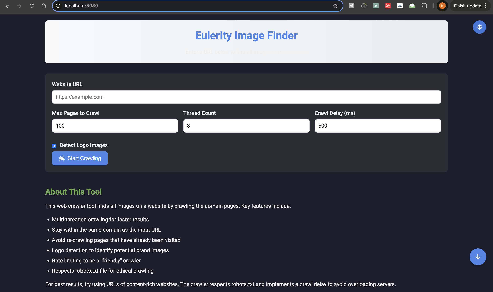
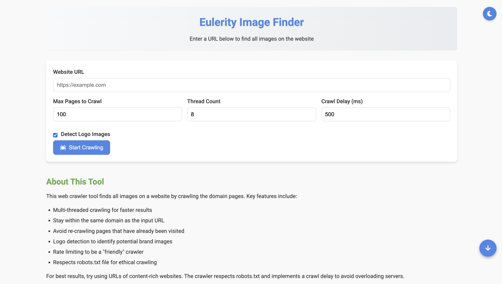
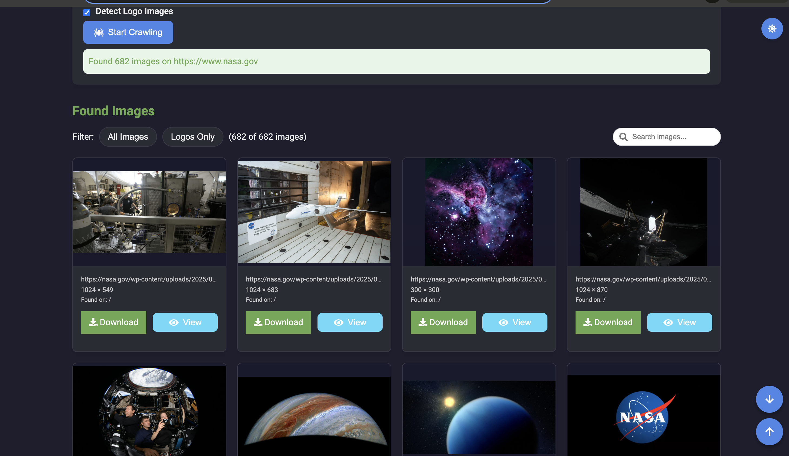
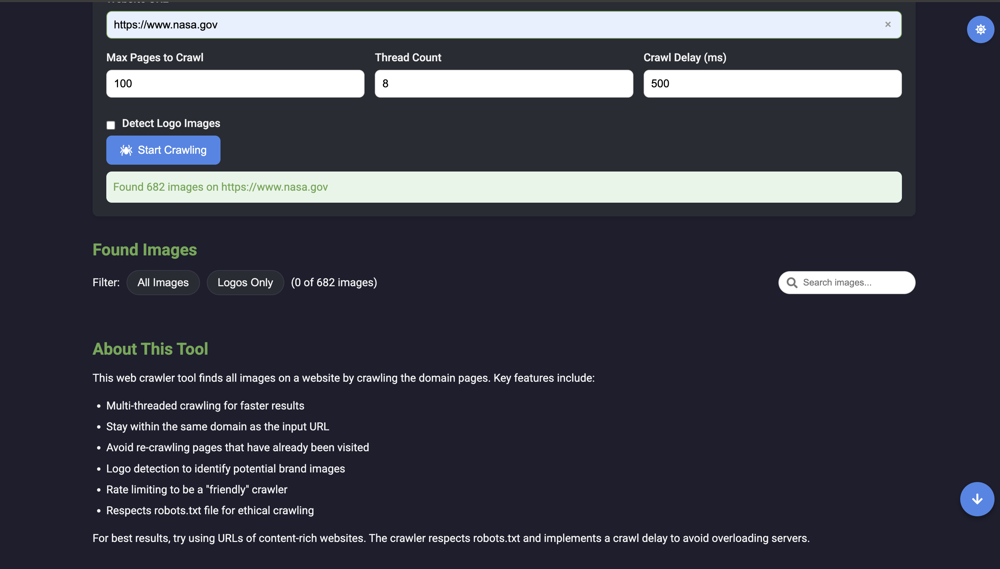
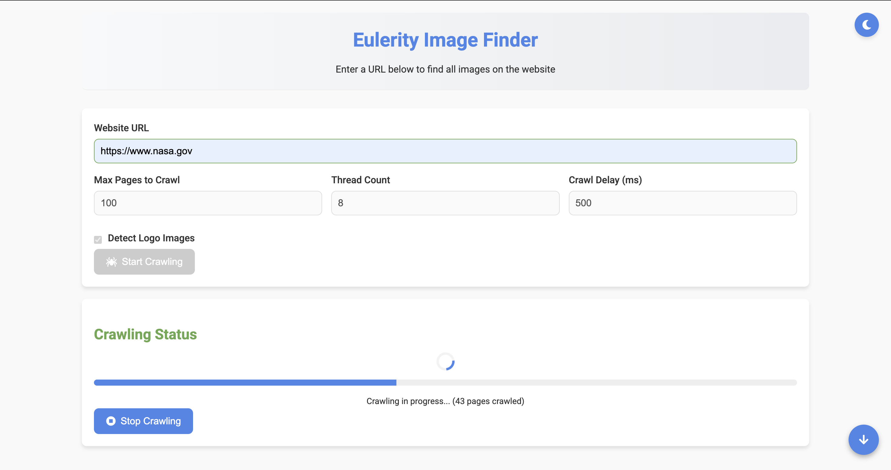

# Eulerity Image Finder - Advanced Web Crawler

## 📸 Project Overview

Eulerity Image Finder is a sophisticated web crawler application designed to efficiently extract images and their metadata from websites while respecting web standards and server resources. Our solution balances performance, user experience, and "good citizenship" on the web, addressing numerous edge cases that commonly cause crawlers to fail.

### UI Features Showcase

| Dark Mode | Light Mode |
|-----------|------------|
|  |  |

### Advanced Image Detection Modes

| With Logos | Without Logos |
|------------|----------------|
|  |  |

### Detailed Crawl Analytics



### Key Visualization Features
- **Dual Mode Support**: Seamless dark and light mode interfaces
- **Logo Detection**: Intelligent filtering of images with and without logos
- **Detailed Analytics**: Comprehensive crawl progress and image statistics
- **Responsive Design**: Clean, intuitive user interface

## 📁 Project Structure

```
IMAGEFINDER 2/
│
├── src/
│   ├── main/
│   │   ├── java/com/eulerity/hackathon/imagefinder/
│   │   │   ├── crawler/
│   │   │   │   ├── ImageMetadata.java
│   │   │   │   ├── LogoDetector.java
│   │   │   │   ├── RobotsTxtParser.java
│   │   │   │   ├── WebCrawler.java
│   │   │   │   └── ImageFinder.java
│   │   │   └── webapp/
│   │   │       ├── WEB-INF/
│   │   │       ├── index.html
│   │   │       └── favicon.ico
│   │   │
│   │   └── test/
│   │       └── java/com/eulerity/hackathon/imagefinder/
│   │           └── ImageFinderTest.java
│   │
│   └── pom.xml
│
└── README.md
```

## ✨ Key Features

- **High-Performance Multi-threaded Crawling**: Efficiently processes websites using configurable thread pools
- **Smart Domain Containment**: Respects domain boundaries to prevent unauthorized crawling
- **Intelligent Logo Detection**: Uses multiple heuristic approaches to identify brand logos
- **Ethical Crawling Standards**: Fully respects robots.txt directives and implements rate limiting
- **Robust Error Handling**: Gracefully manages network issues, malformed URLs, and server errors
- **Advanced Caching**: Implements context-aware caching to improve performance
- **Interactive UI**: Responsive design with filtering, dark mode, and detailed image information

## 🏗️ Architecture

### Backend (Java Servlet)
- **ImageFinder.java**: Main servlet handling HTTP requests and responses
- **WebCrawler.java**: Core crawling engine with multi-threading support
- **LogoDetector.java**: Specialized component for logo identification
- **RobotsTxtParser.java**: Parser for robots.txt to ensure ethical crawling
- **ImageMetadata.java**: Data structure for storing image information

### Frontend (HTML/CSS/JavaScript)
- Responsive design using modern CSS features
- Asynchronous communication with the backend
- Client-side filtering and sorting capabilities
- Progressive image loading and error handling
- Dark mode with persistent user preferences

## 🔍 Unique Approaches

### Advanced Logo Detection

Unlike basic crawlers that rely solely on filename patterns, our logo detection system uses a multi-faceted approach:

1. **URL Pattern Analysis**: Examines URL structures for common logo indicators
2. **Image Dimensions**: Considers image aspect ratios and sizes typical of logos
3. **Alt Text Evaluation**: Analyzes alt text for logo-related terminology
4. **Domain-Name Correlation**: Checks if site name appears in potential logo filenames
5. **Context Awareness**: Considers the image's location in the page's structure

### Robust Crawling Architecture

The crawler implements several advanced techniques:

1. **Exponential Backoff**: Automatically adjusts request rates based on server responses
2. **Redirect Handling**: Intelligently follows and tracks redirects while detecting loops
3. **Content-Type Filtering**: Processes only relevant content types for efficiency
4. **Depth Control**: Manages crawl depth to avoid excessive resource usage
5. **Thread Pool Management**: Efficiently allocates and reuses threads

### Smart Caching System

We developed a context-aware caching system that:

1. Uses composite keys incorporating both URL and detection settings
2. Properly handles parameter changes without requiring page reloads
3. Allows independent cache clearing for specific URLs or parameters
4. Maintains consistent user experience even with changing parameters

## 🛠️ Edge Cases & Solutions

### Edge Case 1: Complex Redirect Chains

**Problem**: Websites often implement complex redirect patterns including temporary redirects, permanent redirects, and meta refreshes that can create loops.

**Solution**: Our crawler implements a sophisticated redirect tracking system that:
- Maintains a history of visited URLs in redirect chains
- Normalizes URLs to detect loops even with slight differences
- Limits maximum redirect depth to prevent infinite chains
- Implements progressive delays between redirects to prevent overwhelming servers

```java
// Better redirect loop detection with normalized URLs
if (visitedUrls.contains(normalizedRedirectUrl)) {
    System.out.println("Potential redirect loop detected. Stopping at: " + redirectUrlStr);
    return response; // Return the last valid response instead of null
}
```

### Edge Case 2: Lazy-loaded Images

**Problem**: Modern websites often defer image loading using JavaScript and data attributes, which standard crawlers miss.

**Solution**: Our image extractor specifically looks for:
- Common data attributes: data-src, data-original, data-lazy-src, etc.
- Srcset attributes for responsive images
- CSS background images in style attributes
- Script-injected images by examining DOM structure

```java
// Check for lazy-loaded images in data attributes
String dataSrc = img.attr("data-src");
if (!dataSrc.isEmpty()) {
    String fullDataSrc = resolveUrl(pageUrl, dataSrc);
    if (!fullDataSrc.isEmpty()) {
        addImage(fullDataSrc, img, pageUrl);
    }
}
```

### Edge Case 3: Rate Limiting and Server Protection

**Problem**: Aggressive crawling can burden servers and lead to IP blocking or service degradation.

**Solution**: Our crawler implements multiple "politeness" mechanisms:
- Respect for robots.txt crawl-delay directives
- Random jitter in request timing to prevent synchronized load
- Progressive backoff on errors with increasing delays
- Configurable thread count and maximum page limits
- Reduced concurrent connections to the same host

### Edge Case 4: Logo Detection Toggle Inconsistency

**Problem**: When toggling the logo detection checkbox, the results weren't properly reflecting the change without a page reload.

**Solution**: Implemented a composite cache key system that combines the URL and logo detection state, ensuring proper cache invalidation when parameters change.

```java
private String createCacheKey(String url, boolean detectLogos) {
    return url + "_detectLogos_" + detectLogos;
}
```

### Edge Case 5: Malformed HTML and Partial Content

**Problem**: Many websites contain malformed HTML that breaks standard parsers.

**Solution**: We use JSoup's robust parsing capabilities and implement additional safeguards:
- Content type validation before parsing
- Maximum body size limitations to prevent memory issues
- Error recovery for partial document processing
- Graceful handling of encoding issues

### Edge Case 6: Varying Content Types and Non-HTML Responses

**Problem**: Crawlers often encounter non-HTML content that can cause processing errors.

**Solution**: Our system implements content type filtering:
- Validates content types before processing
- Handles common MIME types for HTML/XML content
- Skips binary data and unsupported formats
- Properly manages character encoding detection

### Edge Case 7: Cross-Browser Download Compatibility

**Problem**: The HTML5 download attribute is not supported in all browsers.

**Solution**: Implemented a fallback mechanism for image downloads:

```javascript
downloadBtn.addEventListener("click", function (e) {
  e.stopPropagation();
  if (!this.download) {
    e.preventDefault();
    window.open(this.href);
  }
});
```

## 📊 Performance Optimizations

- **Connection Pooling**: Reuses connections where possible to reduce overhead
- **Parallel Processing**: Utilizes multiple threads to process pages concurrently
- **Metadata Extraction**: Collects image metadata during crawling to avoid additional requests
- **Lazy Loading**: Defers image loading in the UI until needed
- **URL Canonicalization**: Reduces duplicate page visits by normalizing URLs
- **Incremental Display**: Shows results as they're discovered rather than waiting for completion
- **Efficient DOM Traversal**: Uses optimized selectors for faster page processing

## 🚀 Getting Started

### Prerequisites

- Java 11 or higher
- Maven (latest version recommended)
- A servlet container (e.g., Apache Tomcat)
- Modern web browser
- Git

### Installation

#### 1. Clone the Repository

```bash
# Choose one of the following based on your preference
# HTTPS
git clone https://github.com/yourusername/eulerity-image-finder.git

# SSH (requires SSH key setup)
git clone git@github.com:yourusername/eulerity-image-finder.git
```

#### 2. Build the Project

```bash
# Navigate to the project directory
cd eulerity-image-finder

# Clean and compile the project
mvn clean compile

# Run tests
mvn test

# Package the application
mvn package

# Run the application using Jetty (Quick Development)
mvn clean compile jetty:run
```

## 🔍 Running the Application

### Option 1: Using Jetty (Recommended for Development)
```bash
# Run the application with Jetty
mvn clean compile jetty:run
```
- Access the application at `http://localhost:8080`
- Provides quick startup and automatic reloading during development

### Option 2: Manual Deployment
1. Package the application
```bash
mvn package
```
2. Deploy the generated WAR file to a servlet container like Apache Tomcat
3. Access the application at the appropriate URL

## 🔍 Usage Examples

### Finding All Images on a Website

1. Enter the website URL in the input field
2. Configure crawling parameters (optional)
3. Click "Start Crawling"
4. Browse through the discovered images

### Searching for Logo Images

1. Enter the website URL
2. Ensure "Detect Logo Images" is checked
3. Start crawling
4. Use the "Logos Only" filter to display detected logos

## 🧪 Testing

Run automated tests:
```bash
mvn test
```

## 🤝 Contributing

1. Fork the repository
2. Create your feature branch (`git checkout -b feature/AmazingFeature`)
3. Commit your changes (`git commit -m 'Add some AmazingFeature'`)
4. Push to the branch (`git push origin feature/AmazingFeature`)
5. Open a Pull Request

## 📜 License

This project is licensed under the MIT License - see the LICENSE file for details.

## 🙏 Acknowledgements

- JSoup for HTML parsing
- Google Gson for JSON processing
- Font Awesome for icons
- The Eulerity team for the project inspiration

## 🚀 Future Enhancements

### Planned Features
1. **Advanced Machine Learning Integration**
   - Implement AI-powered image classification
   - Develop more sophisticated logo and brand detection algorithms
   - Add deep learning models for image content analysis

2. **Performance Improvements**
   - Optimize memory usage for large-scale crawling
   - Implement more advanced caching mechanisms
   - Enhance multi-threading capabilities

3. **User Experience Upgrades**
   - Create a more intuitive and responsive frontend
   - Add real-time progress tracking for crawls
   - Develop advanced filtering and search capabilities

4. **Extended Crawling Capabilities**
   - Support for more complex website structures
   - Improved handling of Single Page Applications (SPAs)
   - Enhanced support for dynamic content loading

5. **Security and Ethical Crawling**
   - Implement more robust IP rotation
   - Advanced respect for robots.txt and website policies
   - Add configurable crawling ethics settings

6. **Export and Analysis Features**
   - Generate comprehensive crawl reports
   - Add image metadata export options
   - Develop visualization tools for crawl results

7. **Cross-Platform Support**
   - Create containerized deployment options
   - Develop cross-platform CLI tool
   - Add cloud deployment configurations

## 🤖 Maintainer

**Kartik Vadhawana**
- GitHub: [@Vkartik-3](https://github.com/Vkartik-3)
- LinkedIn: [Kartik Vadhawana](https://www.linkedin.com/in/kartikvadhawana/)
- Email: kartikvadhwana7@gmail.com

## 📬 Contact

Feel free to reach out for any questions, suggestions, or collaboration opportunities!

---

**Made with ❤️ by Kartik Vadhawana**